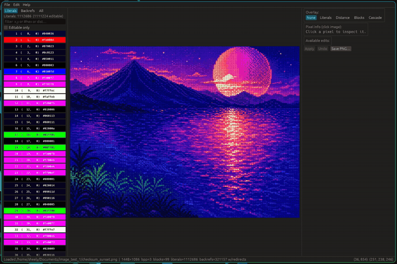

# pngbend


An interactive editor for the DEFLATE bits inside a PNG file. Click a pixel to see which literal or LZ77 back-reference produced each byte; swap a literal or redirect a back-reference; save the result as a valid PNG.



## Background

UCNV's [*The Art of PNG Glitch*](https://ucnv.github.io/pnglitch/) covers PNG glitching across multiple stages of the encode pipeline. pngbend works on the compressed DEFLATE data inside IDAT chunks, replacing random byte hits with same-width Huffman codeword swaps that keep the parser aligned.

## What It Does

- **Inspect** any pixel to see which literal or back-reference produced it.
- **Swap a literal** for another with the same Huffman code length. The change cascades through every back-reference that copies from it.
- **Redirect a back-reference** to a different distance symbol of the same code length and extra-bit count.
- **Visualise** literal/back-ref pixels, distance heatmap, block boundaries, cascade BFS overlay.
- **Save** as a valid PNG.

## Recent Changes

- **The codec is now its own crate, [`glasspng`](glasspng/).** A zero-dependency PNG codec, split out of the editor. Decode to pixels, or read the DEFLATE literal/back-reference event stream and per-block Huffman tables behind each pixel, edit them, and re-emit a valid PNG. `pngbend` drives it.
- **glasspng decodes every PNG; the encoder covers most.** Decode handles all colour types, bit depths, and Adam7 interlacing, checked against the reference `png` crate across the PngSuite corpus. Encode writes the byte-aligned non-indexed types (grey, grey+alpha, RGB, RGBA, 8 or 16-bit) with a DEFLATE compressor: greedy LZ77 plus stored / fixed / dynamic Huffman.

## Current Goals

More surfaces to glitch, from both the codec and the editor:

- **Expose more of the codec.** glasspng models the DEFLATE event stream, per-block Huffman tables, row filters, chunk framing, and interlacing. Making more of it public (block structure, filter choices, encoding parameters) opens each as another glitch surface.
- **Use it in the editor.** Turn those surfaces into edits: re-filter rows, re-encode blocks, relocate interlace passes, change chunk and encoding parameters. Each is a kind of glitch the literal swap and back-reference redirect can't reach.

## Download

Grab the latest binary for your platform from the [Releases page](https://github.com/nsheely/pngbend/releases).

## Build from Source

```sh
cargo run --release                  # GUI
cargo run --release -- path/to.png   # GUI with file pre-loaded
cargo test --workspace               # editor + glasspng: unit + integration + proptest
cargo bench --workspace              # criterion benches
cargo clippy --workspace --all-targets -- -D warnings
```

Drag a PNG onto the window or use **File → Open**. **Ctrl+Z / Ctrl+Y** undo / redo. **Ctrl+Shift+S** save.

## Project Structure

A Cargo workspace: a codec crate plus the editor that drives it.

```
glasspng/                 # zero-dependency PNG codec (the "glass box")
└── src/
    ├── api/              # decode / decode_strict / encode; Image / GlassBox
    ├── bitstream.rs      # LSB-first bit reader/writer
    ├── coords.rs         # OutPos / PixelXY pixel↔byte geometry
    ├── raster.rs         # pass-aware projection (progressive + Adam7)
    ├── deflate/          # RFC 1951 decode + encode, per-event tracking
    └── png/              # chunks, CRC, zlib, IHDR, row filters, interlace, convert

src/                      # pngbend, the egui editor
├── main.rs              # GUI entry
├── composite.rs         # SIMD alpha compositor
├── index/               # pos_to_ev, reverse_graph, cascade, pixel index
├── overlays/            # event / cascade overlays
├── app/                 # GUI (edit, history, panels, IO, selection, ...)
└── bin/profile.rs       # perf-driven profiling binary
```

## License

Dual-licensed under [MIT](LICENSE-MIT) and [Apache 2.0](LICENSE-APACHE).
